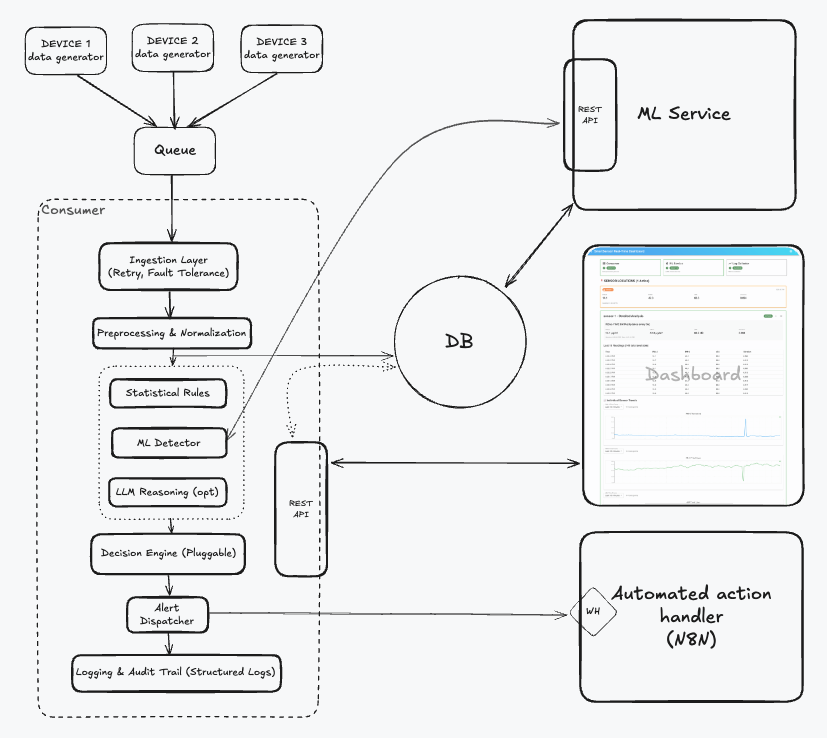
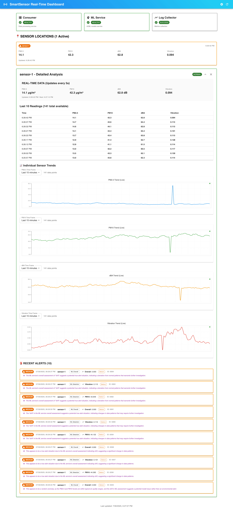

# SmartSensor Situation Handler
A backend system for intelligent environmental sensor monitoring, anomaly detection, and automated alerting—powered by machine learning and AI.

The system features robust data ingestion with fault tolerance and retry mechanisms, ensuring high reliability. It includes data quality preprocessing to maintain data integrity and consistency. At its core is a multi-layer detection engine that combines rule-based logic and ML-based models for comprehensive anomaly analysis. An intelligent decision engine supports context-aware responses, enabling smart and automated actions.

All processed data is stored with reliable persistence, ensuring traceability for auditing, monitoring, and long-term analysis.


## **Architecture Overview**




##  **System Components**

### **Microservices Architecture**

This system demonstrates a modular, microservices-based architecture where each component runs in its own container. This design enables both **horizontal scaling** (e.g., scaling generators or consumers based on queue depth) and **vertical scaling** for performance tuning.

At the core is a **configurable IoT data generator**, which simulates sensor-equipped devices deployed across different locations. Each simulated device publishes time-series data—such as PM2.5, PM10, dBA, and vibration readings—into a central **RabbitMQ message queue**.

A dedicated **consumer service** listens to the queue and performs several key tasks:

* **Validation** of sensor data
* **Storage** of records in a PostgreSQL database
* **Anomaly and noise detection** using a multi-layered approach
* **Optional LLM-based reasoning**, to make context-aware decisions based on multiple data sources
* **Alert dispatching**, which triggers automated workflows via **N8N**, enabling responses such as sending notifications or instructing an external system to take corrective action (e.g., activating an air conditioner if poor air quality is detected)

The detection mechanism includes:

* **Static rule-based checks** for clearly defined thresholds
* A scalable **machine learning service** that supports multiple pluggable detection methods (e.g., STL decomposition, LSTM forecasting). Detection methods can be added or removed independently, making the system flexible and extensible.

To support monitoring and observability, the system leverages a stack of:

* **Promtail** for collecting logs from services
* **Loki** for aggregating and indexing logs
* **Prometheus** for metrics collection
* **Grafana** for real-time dashboards and alert visualization

All activities, including live sensor streams, anomalies, and alerts, are presented through a **React-based UI dashboard**, offering real-time insight into system behavior and health.

For reliability the system has:
- **Fault Tolerance**: Retry mechanisms and graceful degradation
- **Health Checks**: Comprehensive service health monitoring
- **Graceful Degradation**: System continues operating during partial failures
- **Data Persistence**: Complete audit trail in PostgreSQL
- **Scalability**: Independent service scaling capabilities


#### **1. Consumer Service** (`consumer/`)
- **Purpose**: Data ingestion, preprocessing, detection coordination. Please refer to [Sensor Data Consumer](./consumer/README.md) page for more information about its design.
- **Port**: 8001
- **Features**:
  - RabbitMQ message processing
  - Data validation and preprocessing
  - Multi-layer anomaly detection coordination
  - LLM integration for intelligent reasoning
  - Action handling and notifications

#### **2. ML Service** (`ml-service/`)
- **Purpose**: Sophisticated anomaly detection with trained models. Please refer to [Machine Learning Service](./ml-service/README.md) page for more information about its design.
- **Port**: 8002
- **Features**:
  - 12 trained ML models (Z-score, STL, LSTM)
  - Smart model selection per sensor type
  - Real-time anomaly detection
  - Model training and retraining capabilities

#### **3. Dashboard** (`dashboard/`)
- **Purpose**: Real-time monitoring and visualization
- **Port**: 3000
- **Features**:
  - React-based web interface
  - Real-time sensor data visualization
  - Anomaly alerts and history
  - System health monitoring
  - Interactive charts and metrics

#### **4. Generator Services** (`generator/`)
- **Purpose**: Configurable sensor data simulation. please refer to [Synthetic IoT Sensor Data Generator](./generator/README.md) page for detailed configuration options.
- **Features**:
  - 3 configurable sensor generators
  - Different anomaly patterns
  - Realistic sensor data simulation
  - JSON-based configuration

#### **5. Infrastructure**
- **PostgreSQL**: Data persistence and storage
- **RabbitMQ**: Message queue for reliable data flow
- **Nginx**: Reverse proxy for dashboard

## System Logging

System is using a combination of Grafana, prometus, Loki and Promtail to enable effective debugging, monitoring, and analysis.
For details about logging journey please refer to [System Logging](./monitoring/README.md) page


### Quick Start

#### **1. Clone and Setup**
```bash
git clone <your-repo-url>
cd Outcomex
cp env.example .env
nano .env
```

#### **2. Start All Services**
```bash
docker-compose up -d
docker-compose logs -f
docker-compose ps
```

#### **3. Access the System**
- **Dashboard**: http://localhost:3000
- **Consumer APIs**: http://localhost:8001/docs
- **ML Service APIs**: http://localhost:8002/docs
- **RabbitMQ Management**: http://localhost:15672

#### **4. Stop Services**
```bash
docker-compose down
docker-compose down -v
```


## Production Suggestion/Consideration
- [x] Container isolation with Docker
- [x] Environment-based configuration
- [x] Input validation with Pydantic
- [x] Error handling and logging
- [x] Database connection security
- [x] Health checks and monitoring
- [x] Graceful degradation
- [x] Structured logging
- [ ] Unit and e2e tests -> add test stage in CI/CD
- [ ] Kubernetes RBAC implementation - Role-based access control
- [ ] Service mesh (Istio/Linkerd) deployment
- [ ] Cloud key vault integration
- [ ] TLS termination at ingress
- [ ] Network policies
- [ ] Pod security policies
- [ ] Automated backups
- [ ] Multi-region deployment
- [ ] Compliance monitoring
- [ ] Security scanning in CI/CD


