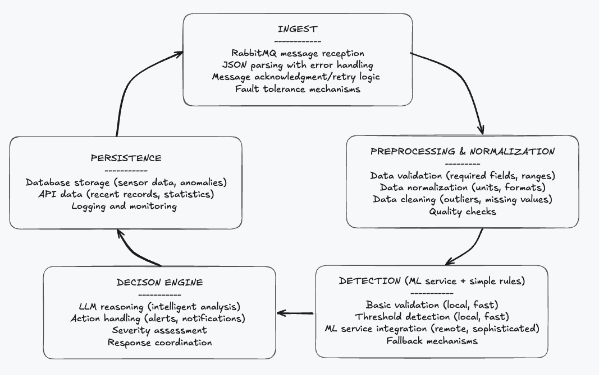

# Sensor Data Consumer

The Sensor Data Consumer is a service designed to process real-time sensor data streams with intelligent anomaly detection and automated response capabilities. This service acts as the central processing hub in the Outcomex IoT monitoring system, handling data ingestion, analysis, and decision-making for sensor networks.

The Consumer transforms raw sensor data into actionable insights through:
- Real-time processing of high-volume sensor data streams
- Multi-layer anomaly detection combining rule-based and ML-powered analysis
- Intelligent decision-making using LLM reasoning for context-aware responses
- Comprehensive data persistence ensuring complete audit trails
- Fault-tolerant architecture with graceful degradation capabilities

The service integrates with RabbitMQ for message queue and reliable data ingestion, ML Service for advanced anomaly detection models including Z-Score, STL, and LSTM, PostgreSQL for persistent storage of sensor data and anomalies, Dashboard for real-time data visualization and monitoring, and the Monitoring Stack with Prometheus and Grafana for system health.

Key capabilities include high throughput processing thousands of sensor readings per second, low latency with sub-second response times for critical alerts, intelligent analysis with context-aware anomaly detection and LLM reasoning, automated actions with smart response coordination based on severity assessment, and scalable architecture supporting horizontal scaling with load balancing.

## **Key Features of This Architecture**

### **1. Robust Ingestion**
- **Fault tolerance**: Handles network issues, malformed messages
- **Retry logic**: Automatic retry for transient failures
- **Error isolation**: One bad message doesn't break the system

### **2. Quality Preprocessing**
- **Data validation**: Ensures data quality before processing
- **Normalization**: Consistent formats across all sensors
- **Cleaning**: Removes obvious errors and outliers

### **3. Multi-Layer Detection**
- **Fast local checks**: Immediate response for critical issues
- **Sophisticated ML**: Advanced pattern detection via ML service
- **Graceful fallback**: Works even if ML service is unavailable

### **4. Intelligent Decision Engine**
- **LLM reasoning**: Context-aware analysis of anomalies
- **Action coordination**: Automated responses based on severity
- **Risk assessment**: Prioritizes responses based on impact

### **5. Comprehensive Persistence**
- **Data storage**: Complete audit trail of all events
- **API access**: Real-time data for dashboards
- **Monitoring**: Performance and health metrics
